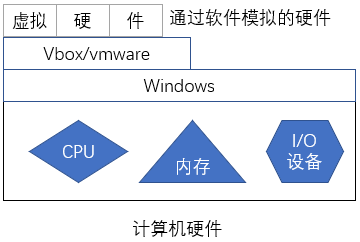
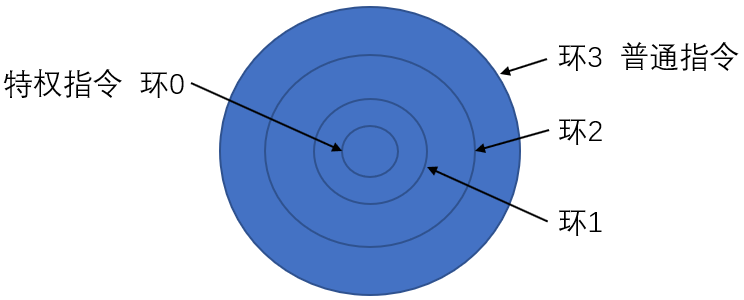
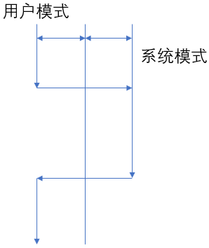

** {{ title }}：** <Excerpt in index | 首页摘要>
操作系统及Linux的基础知识
<!-- more -->
<The rest of contents | 余下全文>
## 操作系统及Linux基础知识

### 现代计算机设备的组成部分

现代计算机的构架主要还是在冯诺·依曼架构之上完成的。主要由运算器、控制器、存储设备、输入设备和输出设备。在现代的制造工艺中将运算器与控制器集成在一片芯片之上叫做CPU。CPU又叫做中央处理器，是计算机的核心部分。同时CPU不是单独自己工作的它又需要与外界进行数据交互，与外界进行的数据交互是通过总线来进行数据的传输的。计算机中的总线有控制总线，数据总线，和地址总线。所谓总线（Bus），是指计算机设备和设备之间传输信息的公共数据通道。总线是连接计算机硬件系统内多种设备的通信线路，它的一个重要特征是由总线上的所有设备共享，可以将计算机系统内的多个部件连接到总线上进行通讯。如果是某两个设备或设备之间专用的信号连线，就不能称之为总线。微机中的总线分为数据总线、地址总线和控制总线3类。不同型号的CPU芯片，其数据总线、地址总线和控制总线的条数可能不同。  数据总线DB用来传送数据信息，是双向的。CPU既可通过DB从内存或输入设备读入数据，又可通过DB将内部数据送至内存或输出设备。DB的宽度决定了CPU和计算机其他设备之间每次交换数据的位数。  地址总线AB用于传送CPU发出的地址信息，是单向的。传送地址信息的目的是指明与CPU交换信息的内存单元或I/O设备。内存是编址的存储单元，所以每个存储单元都有一个固定地址，对于内存来说每8个字节叫做一个cell，要访问1MB存储器中的任一单元，需要给出1M个地址，即需要10位地址（2^10=1M）。因此，地址总线的宽度决定了CPU的最大寻址能力。  控制总线CB用来传送控制信号、时序信号和状态信息等。其中有的是CPU向内存或外部设备发出的信息，有的是内存或外部设备向CPU发出的信息。显然，CB中的每一条线的信息传送方向是一定的、单向的，但作为一个整体则是双向的。所以，在各种结构框图中，凡涉及到控制总线CB，均是以双向线表示。  总线的性能直接影响到整机系统的性能，而且任何系统的研制和外围模块的开发都必须依从所采用的总线规范。总线技术随着微机结构的改进而不断发展与完善。可见地址总线决定来CPU寻址的范围，由此可以看出对于32位的操作系统来说内存的最大寻址范围为32位也就是2的32位次方，也就是4G，由此对于32的计算机来说最大可识别内存也就是4G，对于64位操作系统来说也就是2的64方也就是4G个4G内存范围。

### 程序运行的局部性原理

在程序运行时操作系统会为程序提供内存空间来运行需要执行的程序，在现在的计算机中通常CPU的运行速度要远快与IO设备，对于我的硬件来说我的CPU的运行速度为2.5GHZ但对于内存来说笔记本的内存速度也就是1600MHZ可见内存的速度要远低于CPU的运行速度。为了解决程序运行效率问题加入来缓存机制，缓存的速度是接近CPU的速度的，所以在CPU中会有一级缓存二级缓存和三级缓存，离CPU越近速度越快，但是成本就越高，这就是计算机的折中机制。这里说一下对于计算机的扩展有两种方式一种横向扩展一种纵向扩展横向扩展指的是用多个性能普通的计算机进行组合为一个功能强大的集群来完成复杂的计算功能，而纵向扩展指的是通过提过当个计算机的硬件性能，比如提高CPU的主频，增加内存，使用固态硬盘等方式来增加单个计算的计算性能。通常这种纵向扩展的方式性价比不高。程序界有一种说法为缓存为王，即cache is king 之所以这样说是因为程序运行时会遵循局部性原理，局部性原理表现为：时间局部性和空间局部性。时间局部性是指如果程序中的某条指令一旦执行，则不久之后该指令可能再次被执行；如果某数据被访问，则不久之后该数据可能再次被访问。空间局部性是指一旦程序访问了某个存储单元，则不久之后。其附近的存储单元也将被访问。根据程序的局部性原理我们就可以提前将需要的数据放入缓存中，这样便可以提高计算机的运行效率。

### 计算机的I/O设备

刚说到CPU不是独自工作的，需要与外界设备进行交换，通常这些外部设备就为IO设备。计算机中常见的IO设备有硬盘，网卡，键盘，鼠标，显示器等。

### 虚拟机

通过软件模拟的具有完整硬件系统功能的、运行在一个完全隔离环境中的完整计算机系统。虚拟机的结构如下

对于cpu的虚拟化：其实在现代操作系统结构下cpu就是虚拟化的通过划分时间片的方式来进行任务或是程序的处理。对于cpu的虚拟化只需要指令能够提交给cpu进行运行就行。

内存的虚拟化：现代操作系统对于内存的使用是采用线性地址空间的方式进行数据的存储的。这中内存的使用方式可以提高系统的安全性能。

## Linux基础入门

### CPU中央处理器

CPU由运算器和控制器组成，通常CPU要完成哪些运算，和其运算能力是根据其所支持的指令操作来完成的，这些CPU可用的指令叫做指令集。通常不同生厂商生产的CPU的指令集是不同的。（如果要查看自己CPU所支持的指令集可以使用 cat /proc/cpuinfo 命令查看自己CPU的相关信息）。在CPU设计时将CPU可运行的指令分成了四个环，通常我们叫做环0环1环2环3。CPU的环形结构如下：

环3上只能运行普通指令，而环0上运行的为特权指令，通常我们把运行在环3上的指令叫做用户空间或是用户模式，把运行在环0上的指令叫做内核空间或是内核模式。这样做是为了提高系统的安全性能，因为只有操作系统才可以运行特权指令。而普通用户的程序只能在环3上运行也就是之能运行普通指令，由于历史的原因环1和环2没有使用。有同学会说普通户也需要运行特权指令啊，比如新建文件等需要进行IO操作的指令等，是的没错普通用户是需要运行特权指令，但是当普通用户需要运行特权指令时会向操作系统发出请求即系统调用让操作系统帮忙来完成所需要的操作。对于程序中的系统调用的切换模式如图所示：

当用户需要使用特权指令时就会向操作系统发出系统调用此时有操作系统代为执行所需的指令来完成某些所需的特权操作。

### CPU的架构类型

记得一次上课老师问计算机的构架是什么有同学说X86有同学说X64等等，其实这些都是概念没有搞清楚。当代计算机都还没有打破冯诺.依曼的架构。这里说CPU的架构吧，当前PC机中的CPU架构有X86即32位的CPU，X64即64位CPU，对于X86_64结构是英特尔和AMD兼容的CPU结构类型。还有现代比较流行的人手一个的手持智能终端设备中用的ARMCPU，这种ARM架构的CPU最大的特点就是省电，ARM这个公司很诡异，这个公司只卖版权，不生产CPU，生产是由高通，三星等这些公司。还有一些早些比较强悍的CPU比如moto公司的M68000,IBM的powerCPU，powerCPU是世界上第一个多核心第一个8核第一个16核，第一个主频突破4GHZ的CPU，但是IBM的制造工艺没有INTEL公司的制造工艺先进。还有简装版的power叫做powerPC的CPU，该CPU是由苹果，摩托罗拉，和IBM三家联合设计研发的CPU，这个CPU性能也很不错，当时苹果公司的电脑用的都是powerPC，因为CPU的指令集不同，所以早些时候MAC操作系统无法在普通的PC机上运行，后来INTEL公司的CPU性能慢慢也很不错，所以现在苹果公司用的也是intel的CPU，这也就导致了很多黑苹果的诞生。

### 操作系统（OS:Operating System）

操作系统是管理和控制计算机硬件与软件资源的计算机程序，是直接运行在“裸机”上的最基本的系统软件。说白了操作系统就是一个软件程序，但是这个软件程序是出于通用目将底层硬件的接口抽象出来的来提供硬件驱动、进程管理、内存管理、网络管理、安全管理等功能的通用软件。
当前主流的操作系统有windows，Linux，Unix等。
Windows是每个人都接触过的操作系统，这里就不多说了，但是这个系统属于那种入门简单鼠标点一点感觉很轻松但是深入却很难的一套操作系统。算算接触Windows也快20年了也就会操作系统的安装，软件的安装，Ctrl+Alt+Delete结束进程等很简单的操作。
Unix可以说是世界操作系统的鼻祖，如果有兴趣可以查一查关于windows是如何从乔布斯那里抄袭创意和乔布斯如何从Park实验室那里抄袭。可以看出伟大的人的创意都是抄袭的。Unix有两个重要分支，其中嫡出系统叫做system风格的Unix是由Bell实验室研发的。属于system风格的操作系统还有IBM公司的AIX，SUN公司的Solaris，HP公司的HP-UX等，另一个分支叫做庶出也就是小老婆生的叫做BSD，是由伯克利研究小组（BSRG）进行研发的叫做Berkeley System Distribution。其中基于BSD的流行的系统有**NETBSD**,**OPENBSD**,**FREEBSD**等。我们生活中对Unix不常见的原因在于Unix通常叫做贵族操作系统，之所以这样说是因为UNIX通常是在小型机上跑的操作系统，而一台小型机怎么也要二三十万左右的样子，不像Linux在2000块钱的主机上都可以跑的飞起。
在嫡出和庶出打仗的时候unix是收费的此时由MIT的Richard Stallman发起了软件共产主义运动，即GNU（GUN is not Unix）组织，和共产主义宣言即GPL（General Public License）协定。GNU组织的成立主要是因为UNIX从开源变为收费为了摆脱UNIX而成立的组织，但当时GNU叫做GUN is not Unix但是该组织中的开源程序还是基于Unix的这就陷入了一个尴尬的环境，此时GNU迫切需要一个自己的操作系统，就在此时1991年Linus的linux诞生了，当linux碰到GNU那就是山无棱,天地合,才敢与君绝，一拍即合。所以linux发展速度很快。Linux内核由1991的0.01版本迅速发展在1994年就发行了1.0版本。可见Linux的发展的迅速的。如果要查看最新内核的版本情况  [点击这里](https://www.kernel.org/) 。小时候看黑客帝国的时候就看的是大战母体的打斗的场景，那会还不了解Linux其实现在接触Linux才发现那是里面好多的工具都是我们常用的运维工具，比如matrix也就是母体用的Linux内核就是6.4版本的。

### 操作系统的层次结构

操作系统的层级结构如下：

从操作系统的层级结构下来说编程层次：

程序员面对的编程对象不同分为如下：

> * 硬件规格 ：hardware specifiacation
> * 系统调用：目前linux内核支持的系统调用有400多个的样子
> * 库调用：library call

对于操作系统来说肯定还会和人进行交互，此时操作系统就需要有用户交互程序，通常这个程序叫做shell是内核的壳程序。用户交互程序叫做UI：user interface 目前对于UI主要有两种风格，一种基于图形界面的典型代表为windows下的交互程序。这种交互程序叫做GUI(也有人叫做鬼谐音而已)：Graphic User Interface。另一种是基于命令行的交互程序，那就是Linux代表的一类接口。叫做CLI：Command Line Interface 。其实对于命令行接口来说可能入门较难但是效率通常会比图形界面下的执行效率要高很多。

---

---EOF
