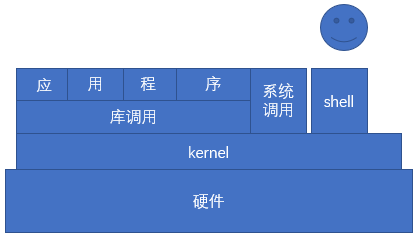

** {{ title }}：** <Excerpt in index | 首页摘要>
OS Linux发行版，Linux系统基础使用入门，Linux命令帮助
<!-- more -->
<The rest of contents | 余下全文>
## Linux基础入门（一）

### POSIX规范

POSIX表示可移植操作系统接口(Portable Operating System Interface of UNIX，缩写为 POSIX ），POSIX标准定义了操作系统应该为应用程序提供的接口标准，是IEEE为要在各种UNIX操作系统上运行的软件而定义的一系列API标准的总称，其正式称呼为IEEE 1003，而国际标准名称为ISO/IEC 9945。

POSIX标准意在期望获得源代码级别的软件可移植性。换句话说，为一个POSIX兼容的操作系统编写的程序，应该可以在任何其它的POSIX操作系统（即使是来自另一个厂商）上编译执行。

我们都知道window的程序是不可以在Linux系统下运行的（前段时间在Linux下安装微信或是QQ啥的，其实直接运行是不可以的，如果要运行QQ是需要wine叫做红酒杯的容器，在这个容器之上才可以运行特殊的windows程序）。我们都知道windows可执行程序的格式为EXE或是MSI格式，运行的库的格式为.dll(dynamic link library)，而在Linux下可执行的程序格式为ELF格式的（拿ls命令来说吧，在终端下直接运行**file /bin/ls**可以看到ls可执行文件的格式为ELF格式），Linux所运行的库的格式为.so（shard object 共享对象）。其实这两者的不同在上次已经说过叫做ABI接口不同。对于POSIX规范其实规定的是API接口的规范，如果windows和Linux的库调用方式相同（当然其内部的实现方式是可以不同的），这样程序员写出的程序就可以在不同的操作系统之间进行编译，实现了程序的移植性和通用性。

### 编程语言层级

程序是由指令+数据组成的，通常指令都为只读的，而数据是可以读写的。其实程序的主要作用就是对我们所提供的原始数据进行加工，加工为我们所需要数据格式或是运行结果。所以也可以说程序是由算法+数据结构组成的。上一集也提到过操作系统的层级结构如图所示：



可以看到对于程序的编写可以面向系统调用层次，或是库调用层次进行编程。系统调用或是库调用是允许被调用的程序，他们只提供程序而不能提供数据，这样也是可以多个程序调用的保障。采用这种调用方式可以在内存中对相同调用的库只进行一次存储，这样就会极大的节省内存。对于这两种调用来说其实就是更底层的调用，系统调用和库调用（对于Linux下的库通常为glibc库）通常都是C写的性能很好但是需要程序员对内存或是运行精心的设计，这对程序员是一个很大的工作，同时对于程序来说也很可能有bug。对于网络中有一种攻击方式叫做缓冲区溢出，这种方式就是利用程序的bug来覆盖内存中的某些数据从而侵入其他系统的操作。但是这种更底层的方式通常运行效率比较高，但是程序不易开发。对于对性能要求较高的系统级程序比如MySQL这类数据库软件通常都是直接面向系统调用或是库调用开发完成的。由于这种程序开发方式过于底层，不易编程所以在此基础上出现了很多更高级的编程语言，这类语言是直接面向该种语言的解释器或是虚拟机编程的所以是高级的语言，比如JAVA PYTHON PHP等，这种方式因为要运行虚拟机或是解释器还要运行垃圾收集程序等所以这种语言编写的程序通常效率会比较低。但是对于那些对性能要求不高的终端程序的开发来说是非常高效的。由于这些语言是面向虚拟机或是解释器和硬件没有任何关系(当然解释器或是虚拟机也是由C语言编写的，需要考虑硬件的兼容性的)，这种编写的程序一般就是一次编写到处运行。

编程语言层次总结如下：

> * 汇编语言：微码编程
>   * 系统中某些与硬件相关的代码，驱动程序开发
> * 高级语言：C或C++
>   * 系统级应用，和对性能要求较高驱动程序开发等
> * 高级应用：JAVA,Python，PHP
>   * 开发应用程序，一次编写到处运行

### Linux的发行版

从操作系统的层级结构可以知道对于Linux操作系统来说由kernel，glibc，和一个人机交互的UI程序，通常Linux系统下的UI程序为bash（CLI），可以试想如果我们要想学Linux我们拿到的只有这些源程序。先不说学Linux就先将这些零件组装成一个可以运行的操作系统怎么也要需要半年或是更多的时间的吧。所以如果对于新手这样学Linux...我想这样能学Linux的人也就更少了。

所以就有一些有能力的人从中看到商机，他们负责将这些源程序进行编译，组合在一张光盘内，而对于使用者可以直接将光盘插入电脑然后下一步下一步就能完成操作系统的安装。这样打包发行的企业叫做发行商，而他们所做的系统叫做发行版。目前主流的发行版有如下几个：

> * SlackWare：
>   * 基于SlackWare的二次发行版：S.U.S.E  
>   * 基于S.U.S.E的二次发行版：OpenSUSE 
>   * 对于suse（一只绿色的大蜥蜴）通常在欧洲国家比较流行，在国内对于华为公司他们在欧洲会有很多项目所以华为公司通常都会要求会S.U.S.E
> * debian：
>   * debian目前采用的还是社区维护方式，没有企业作为后台支持，但这也是最具有原汁原味的Linux发行版。
>   * 基于debian的最著名的发行版，反正目前实验室用的全是这个版本：ubuntu 
>   * 基于ubuntu的二次发行版，MINT这个版本作为桌面版确实漂亮，我在U盘中安装系统就是这个： 
> * Redhat：
>   * redhat1993年成立（和我一样大的岁数，这也是我为什么如此喜欢redhat的缘故），是目前最流行的服务器运行版本。因为在服务器上运行所以要求较高的稳定性，通常18个月发行一个新版本。
>   * redhat公司在 2003年成立Fedora（个人桌面版本）：
>   * 主要是测试新版本的bug和测试新软件，通常每6个月发行一个新版本。
>   * 基于redhat的二次编译发行版 CentOS ：
>   * 国内服务器目前使用最对的版本。我的虚拟机中安装的也是这个版本。
> * ArchLinux：
>   * 最近出现的发行版，它的特点是有轻量级的系统和精巧的程序包管理器。
> * Gentoo：
>   * Gentoo是门槛比较高的操作系统，通常它的所有软件都需要自行编译安装，它认为这样才可以更好的发挥硬件的性能。
> * Android：
>   * 对于安卓肯定不陌生。它的组成是linux内核+busybox+java虚拟机组成，所以他也算是linux的一个版本吧。

### 开源协定

GNU当初进行软件共产主义运动的目的就是实现软件的自由话，开源协定的目的就是实现软件的自由话，自由意味着对开源软件可以自由学习和修改（也就是支持任何打开方式）自由分发，自由创建衍生版。

这里只介绍一些开源协定：

> * GPL：
> * LGPL：
> * Apache：
> * BSD：

### Linux的哲学思想

了解Linux的哲学思想可以指导我们如何学习Linux，及如何更快的了解其本质。

  [x] 一切皆文件

  把几乎所资源包括硬件设备都组织为文件格式，可以对任意设备进行类似文件的操作，read，close，open，close等操作。

  [x] 由众多单一目的的小程序组成

  一个程序只实现一个功能，而且要做好，组合小程序完成复杂任务。

  [x] 尽量避免跟用户交互

  目标：实现脚本编程，可以自动完成某些功能。

  [x] 使用纯文本文件保存配置信息

  目标：一款合用的文本编辑器即能完成系统的配置工作。

### 获取Centos的发行版
通过国内的镜像站点即可获得Centos的发行版。

[阿里云镜像站](https://mirrors.aliyun.com/centos/)

[163镜像站](http://mirrors.163.com/)

## Linux基础入门（二）

### Linux的终端类型

我们在使用Linux时其实经常和终端打交道。终端是用户与主机交互必然要用到的设备。在早些UNIX的时代那是的大型机为了实现多用户的方式就设置了分屏器，分屏器中有很多接口可以接入显示器设备和键盘设备。这样用户只要带着自己的显示器和键盘就可以登入系统。这就是UNIX的多用户多任务操作系统，在后来Linux也继承了UNIX的多任务多用户的模式，其实Linux叫做UNIX-Like操作系统，它的操作和UNIX还是非常像的。下面来说Linxu下的终端类型有如下几种：

> * 物理终端：直接接入本机的显示器和键盘设备。在现代的Linux系统下物理终端只在系统启动时的运行结果的输出，而当系统完全启动之后就不会再使用了。物理终端的设备文件为：/dev/console
> * 虚拟终端：附加在物理终端之上的以软件方式虚拟实现的终端，对于CentOS来说默认启动6个虚拟终端。按住Ctrl+Alt+F# #号的取值范围为[1,6]。虚拟终端的设备文件为：/dev/tty#。对于虚拟终端如图所示：
> * 图形终端：附加在物理终端之上的以软件方式虚拟实现的终端，额外会提供桌面环境。对于图像终端就是我们安装好Linux如果安装了KDE或是GNOME桌面环境，然后开机所看到的桌面环境。
> * 模拟终端：纯软件方式实现，而且不会附加在物理终端之上，而是附加在图形终端或远程终端。图形界面下打开的命令行接口，基于ssh协议或telnet协议等远程打开的界面都叫做模拟终端，模拟终端的设备路径为：/dev/pts/#。我这里使用的xshell登陆的服务器如图所示：

### 交互式接口

终端是一个软件但是不是交互软件，启动终端后，在终端设备附加一个交互式应用程序，这个应用程序叫做交互式接口。

Linux下交互式接口有两类，一类为图形桌面（GUI），令一类为命令行接口（CLI）。

> * GUI图形接口：
>   就是我们启动Linux后的图形桌面，它是由X protocol，window manager，desktop（桌面系统）组成的。常见的Linux桌面系统主要有如下几种：
>   1. GNOME：使用C语言在gtk下进行研发的（C,GTK）。
>   2. KDE：使用C++语言在QT下就行研发的（C++,QT）。
>   3. XFCE：轻量级桌面系统适用于嵌入式硬件资源比较差的环境，常见的ubuntu的xubutu的桌面环境就是XFCE。
> * CLI命令行接口：
>   在命令行下我们登入系统系统就会给我们提供一个shell程序，shell程序是整个系统的外壳，通过它才可以和系统的内核打交道，所以起名为shell（壳，或是炮弹的壳）。常见的shell程序主要有如下几种：
>   1. sh：由bourn研发，这个shell最早是unix的shell程序，因为它是最早的shell程序起名叫做shell牌shell。
>   2. csh：使用C语言进行研发，相对于sh提供更多的特性和接口。
>   3. ksh：由korn研发命名为ksh基于sh兼容csh的诸多特性，并提供更多的新特性。
>   4. bash：（bourn again shell）是sh的升级版，遵守GPL协定即完全开源。bash是目前Linux的默认shell程序。
>   5. zsh：虽然使用了最后一个字母，但是这个shell用的人很少。

### 查看系统当前使用的shell

系统当前使用的shell会保存在SHELL环境变量下，所以直接读取SHELL环境变量的值则可以查看当前系统所用的shell。

```shell
[zhangshuo@localhost ~]$ echo $SHELL
/bin/bash
```

### 显示当前系统所有可以使用的shell

```shell
[zhangshuo@localhost ~]$ cat /etc/shells
/bin/sh
/bin/bash
/sbin/nologin
/usr/bin/sh
/usr/bin/bash
/usr/sbin/nologin
/bin/tcsh
/bin/csh
```


### bash的命令提示符

我们打开任何一个终端登入系统之后都会看到`[zhangshuo@localhost ~]$` 这样的字样，这就是prompt，首先对于`[zhangshuo@localhost ~]`这个显示样子是由bash提供的，是由一个叫做PS1环境变量所定义的，我们可以看一下PS1所定义的内容如下所示：

```shell
[zhangshuo@localhost ~]$ echo $PS1
[\u@\h \W]\$
```

对于这段不叫做提示符，这段后面的$符是真正的命令提示符。Linux的命令提示符有两种：

1. 普通用户的提示符：$
2. 管理员的的提示符：#

### shell运行程序的过程

shell要运行程序只需要在命令提示符下输入命令，然后按回车键即可运行程序。提交程序的过程为提请shell程序找到键入命令所对应的可执行程序或代码，并由其分析后提交给内核分配资源并将其运行起来。程序其实是放在硬盘中的代码，但是程序在运行起来之后就表现为一个或多个进程。

shell中可执行的命令有两类：

1. 内建命令：由shell自带的，而且通过某命令行形式提供。
2. 外部命令：在当前系统的某文件系统路径下有对应的可执行程序文件。对于外部命令可以使用which，whereis来查看该命令所在的位置（这个位置为可执行二进制程序所在的位置）。

区别内部命令或外部命令的命令：

`type COMMAND`

比如：

```shell
[zhangshuo@localhost ~]$ type type
type is a shell builtin
```

### 运行命令格式

`COMMAND [OPTIONS] [ARGUMENTS]`

选项：用于启用或关闭命令的某个或某些功能，选项又分长选项和短选项。

&emsp;&emsp;短选项：-c ，例如ls命令的 -l ，-h 多个短选项可以合并使用，例如`ls -l -h`可合并使用为 `ls -lh`

&emsp;&emsp;长选项：--word，例如ls命令的 --long,--human-readable

参数：命令的作用对象（给命令提供的数据）

注意：

1. 多个选项以及多个参数和命令之间都应该使用空白字符进行分割。
2. 取消命令执行：Ctrl+c

### 文件系统

计算机中的文件都有两类数据：

1. 元数据：metadata 文件的文件名，时间戳，大小，路径等外围特征都为元数据。
2. 数据：data 就是文件中所存放的数据内容。

#### Linux下的文件格式

1. 文件名严格区分字符大小写：file1，File1，FILE1三个文件表示三个不同的文件。
2. 文件名可使用除/以外的任意字符，不建议使用特殊字符。
3. 文件名长度最长不能超过255个字符。
4. 所有以.开头的文件都为隐藏文件。

#### Linux下的路径格式

1. 绝对路径：从根目录起始的路径。
2. 相对路径：从当前位置起始的路径。当前位置的表示方式：（1）./（2）省略上述符号（3）..表示当前目录的上一级目录。
3. 当前目录：current directory，也称作working directory ，登入系统之后会一直处于某个目录下，当前所处的目录就为当前目录或工作目录。

查看当前目录的命令为：`pwd` （printing working directory 的首字母缩写）。

其实对于各个Linux的发行版来说它们的根目录的结构都很类似，因为他们都遵循LSB（Linux standard base）规范。目的是对于各个发行版都可以很快使用而保持linux的结构。

## Linux的命令帮助

Linux下的命令有成千上万个我们不可能都记住每个命令，包括每个命令的选项所表示的内容。所以我们一般记得需要完成相应的工作所使用的对应的命令的名字就行，当然对于常用的命令的选项格式还是需要记得的。所以知道命令名称查看该命令的详细使用方式时就需要查看该命令的帮助文档。

### 对于内部命令帮助的获取

使用：help COMMAND即可获取内部命令的使用帮助。

### 对于外部命令帮助的获取

1. COMMAND --help 或是COMAND -h即可查看简要的帮助信息。
2. 使用手册（manual）。使用方式：man COMAND
3. 信息页。使用方式：info COMMAND
4. 程序自身的帮助文档。程序包中的README INSTALL CHANGLELOG等文件中可以查看。
5. 程序官方文档。
6. 发行版的官方文档。
7. 百度或是Google

### 程序运行过程和hash

上面的shell运行程序的过程也提到过，shell会寻找命令所在的位置然后运行。它的搜寻过程肯定不是在整个根目录下进行寻找，因为这样不仅浪费时间而且没有必要，因为通常可执行的文件一般都会放在固定的路径中，对于这些路径会在小红帽第三集中进行说明。所以shell寻找路径是有目的的寻找的，它只会在PATH环境变量中规定的路径进行搜索。查看自己的环境变量值可以使用`echo $PATH`来查看程序的搜索路径。

注意：shell对于PATH环境变量中的路径是按着自左至右的顺序去寻找，如果找到则停止寻找。

shell本身在查找到程序之后为了加速程序运行会将本次找到的命令路径结果会缓存至KV(KEY-VALUE，键值存储)中，当下次再次运行该命令时则直接在缓存中查找速度会更快。查看系统中的键值存储命令为：`hash`。如下所示：

```shell
[zhangshuo@localhost ~]$ hash
hits	COMMAND   
   1	/usr/bin/man
   2	/usr/bin/ls
   1	/usr/bin/free
   7	/usr/bin/clear
```

注意：当某程序被哈希时，若此时移动该程序则再次运行该命令会找不到该命令，即使移动后的位置在PATH环境变量中，此时应该清楚hash后重新运行该程序。清楚哈希缓存的命令为：`hash -r`

### 命令历史的管理

命令历史的作用是记录我们登陆系统之后所执行过的命令，登陆shell时，系统会读取命令历史文件中记录下的命令。历史文件为：`~/.bash_history`文件。登陆进shell后新执行的命令只会记录在缓存中，这些命令会在用户退出系统时追加至命令历史中。例如我的系统查看家目录下的.bash_history的内容如下：

```shell
[zhangshuo@localhost ~]$ cat .bash_history 
ifconfig
ping www.baidu.com
shutdown -r now
ifconfig
su - root
exit
su - root
ifconfig
```

查看目前缓存的命令为：`history`，我系统部分缓存的结果为：

```shell
[zhangshuo@localhost ~]$ history 
1  ifconfig
2  ping www.baidu.com
3  shutdown -r now
4  ifconfig
```

history命令的使用：

&emsp;&emsp;-a：追加本次会话新执行的命令历史列表至命令历史文件中。

&emsp;&emsp;-d：删除命令历史中指定偏移位置处的命令历史。

&emsp;&emsp;-c：清空命令历史。

### bash特性之一命令历史

可以看到history命令的执行结果的命令都有序号，此时可以使用：!#:运行历史中第#条命令。!string：运行命令历史中最近一个以string开头的命令。!!:重复运行上一条执行的命令。

### 外部命令的获取详解

1. man COMMAND

使用man命令查看所需命令的帮助文档，对于帮助文档大部分为纯文本文件，所以为了节省空间一般都是压缩存放，而man命令的作用就是找到对应的帮助文档然后解压缩后按着规定的样子进行显示。man的手册页在：/usr/share/man中存放。查看一下/usr/share/man中所存放的内容如下：

```shell
[zhangshuo@localhost ~]$ ls /usr/share/man
ca  de  fr  it  man0p  man1x  man3   man4   man5x  man7   man8x  mann       pt     sk  uk
cs  en  hu  ja  man1   man2   man3p  man4x  man6   man7x  man9   overrides  pt_BR  sv  zh_CN
da  es  id  ko  man1p  man2x  man3x  man5   man6x  man8   man9x  pl         ru     tr  zh_TW
```

可以看到有man1-man9这样几个文件夹。

注意：有些命令在不止一个章节中存在帮助手册，要查看指定章节中的手册可以使用：`whatis COMMAND`来查看命令所存在的章节情况。例如查看read命令所在的man章节如下：

```shell
[zhangshuo@localhost ~]$ whatis read
read (1)             - bash built-in commands, see bash(1)
read (1p)            - read a line from standard input
read (2)             - read from a file descriptor
read (3p)            - read from a file
```

常用的章节为man1-man8，各个章节所存放的内容如下，可以使用ls命令查看各个文件夹下所包含的内容：

​	man1：用户命令
​	man2：系统调用
​	man3：库调用
​	man4：设备及特殊文件
​	man5：配置文件格式
​	man6：游戏
​	man7：杂项
​	man8：系统管理类命令

man搜寻对应命令的帮助文件和shell查找所要运行的命令的原理类似，对于man的查找也是需要规定它的查找路径的，它的配置文件为：/etc/man_db.conf 该文件的首部内容可以使用cat命令来查看内容如下：

```shell
# This file is used by the man-db package to configure the man and cat paths.
# It is also used to provide a manpath for those without one by examining
# their PATH environment variable. For details see the manpath(5) man page.
#
# Lines beginning with `#' are comments and are ignored. Any combination of
# tabs or spaces may be used as `whitespace' separators.
#
# There are three mappings allowed in this file:
# --------------------------------------------------------
# MANDATORY_MANPATH                     manpath_element
# MANPATH_MAP           path_element    manpath_element
# MANDB_MAP             global_manpath  [relative_catpath]
#---------------------------------------------------------
# every automatically generated MANPATH includes these fields
#
#MANDATORY_MANPATH                      /usr/src/pvm3/man
#
MANDATORY_MANPATH                       /usr/man
MANDATORY_MANPATH                       /usr/share/man
MANDATORY_MANPATH                       /usr/local/share/man
#---------------------------------------------------------
```

在配置文件中定义了MANDATORY_MANPATH的全局变量，该全局变量定义了man寻找帮助文档的路径。如果要加入新的man位置可以在此增加MANPATH的路径，或使用命令：`man -M /PATH/TO/SOMEWHERE COMMAND`指定man命令到该指定的路径下搜索COMMAND命令的手册页并显示之。

使用man打开的帮助手册中的内容段落说明：

&emsp;&emsp;NAME:名称

&emsp;&emsp;SYSNOPSIS：命令的简要说明

&emsp;&emsp;&emsp;&emsp;[]:表示可选内容

&emsp;&emsp;&emsp;&emsp;<>:表示必选内容

&emsp;&emsp;&emsp;&emsp;a|b:二选一

&emsp;&emsp;&emsp;&emsp;...:同一内容可以出现多次

&emsp;&emsp;DESCRIPTION：命令的描述

&emsp;&emsp;OPTIONS：选项

&emsp;&emsp;EXAMPLES：例子

&emsp;&emsp;AUTHOR：作者

&emsp;&emsp;REPORTING BUGS：报告bug

&emsp;&emsp;SEE ALSO：也可以查看	

2. info

&emsp;&emsp;info COMMAND ：查看信息页

3. 程序自身的帮助文档

&emsp;&emsp;对于程序自身的帮助文档一般会放在：/usr/share/doc/COMMAND-VERDION，所对应COMMAND的帮助文档，可以在此来查看关于该命令更多的帮助说明。

## Linux基础命令（三）

### 关于时间的命令

date命令：

```shell
date [OPTION]... [+FORMAT]：显示时间
date [-u|--utc|--universal] [MMDDhhmm[[CC]YY][.ss]]：设置时间
```
FORMAT：用来显示的格式符号

&emsp;&emsp;%D:获取日期

&emsp;&emsp;%F:获取日期

&emsp;&emsp;%T:获取时间

命令效果如下：

```shell
[zhangshuo@localhost ~]$ date +%D
07/20/18
[zhangshuo@localhost ~]$ date +%F
2018-07-20
[zhangshuo@localhost ~]$ date +%T
10:52:19
[zhangshuo@localhost ~]$ date +"This year is %Y.%nToday is %d."
This year is 2018.
Today is 20.
[zhangshuo@localhost ~]$ 
```

Linux的两种时钟：

&emsp;&emsp;系统时钟：由Linux内核通过CPU的工作频率进行的计时

&emsp;&emsp;硬件时钟：由板卡或是RTC硬件记录的时钟

查看硬件时钟的命令为：

```shell
[zhangshuo@localhost ~]$ sudo hwclock
[sudo] password for zhangshuo: 
Fri 20 Jul 2018 10:57:00 AM CST  -0.035020 seconds
[zhangshuo@localhost ~]$ sudo clock
Fri 20 Jul 2018 10:57:06 AM CST  -0.684968 seconds
```

注意：该命令需要管理员权限。

如果两个时钟不同步时可以使用：

```shell
hwclock -w :将系统时间同步到硬件时间
hwclock -s :将硬件时间写入到系统时间
```

查看日历的命令：

`cal`可以查看当前的月历。使用如下：

```shell
[zhangshuo@localhost ~]$ cal
July 2018     
Su Mo Tu We Th Fr Sa
1  2  3  4  5  6  7
8  9 10 11 12 13 14
15 16 17 18 19 20 21
22 23 24 25 26 27 28
29 30 31
```

也可以使用：`cal 2018`来查看年历

### 目录相关的命令

对于家目录或主目录：

&emsp;&emsp;管理员的家目录为：/root

&emsp;&emsp;普通用户的家目录：/home/USERNAME  比如我的家目录为：/home/zhangshuo

&emsp;&emsp;~:表示用户的主目录。

cd命令：change directory 改变目录

&emsp;&emsp;使用cd或cd ~:回到当前用户的主目录

&emsp;&emsp;cd ~USERNAME:切换至指定用户的主目录（只有管理员才有进入其他用户主目录的权限）

&emsp;&emsp;cd -：在上一个目录和当前目录之间来回切换。（该技巧号称unux管理员惯用十大技巧之一）

相关的环境变量：

&emsp;&emsp;PWD：保存了当前工作目录的路径。可以使用 echo $PWD来查看此时PWD环境变量中所保存的内容。

&emsp;&emsp;OLDPWD：保存了上一次所在目录的路径。当然也可以使用echo来查看。

&emsp;&emsp;`pwd`命令可以显示当前目录的路径，使用如下：

```shell
[zhangshuo@localhost ~]$ pwd
/home/zhangshuo
```

ls命令：list 显示指定路径下的文件列表

&emsp;&emsp;ls [OPTION]... [FILE]...

&emsp;&emsp;&emsp;&emsp;-a,--all:显示所有文件，包括隐藏文件（以.开头的文件或文件夹）。

&emsp;&emsp;&emsp;&emsp;-l,--long:以长格式显示，比如

```shell
[zhangshuo@localhost lftpfile]$ ll hexo.tar.bz2 
-rw-rw-r--. 1 zhangshuo zhangshuo 105330699 Jul 18 09:55 hexo.tar.bz2
```

&emsp;&emsp;&emsp;&emsp;&emsp;&emsp;其中：-rw-rw-r--

&emsp;&emsp;&emsp;&emsp;&emsp;&emsp;最左侧的第一位表示：文件类型，Linux下的文件类型有：-(普通文件),d(目录文件),l(符号链接),b(块设备),c(字符设备),p(管道文件),s(套接字)。

&emsp;&emsp;&emsp;&emsp;&emsp;&emsp;后面的9位表示：访问权限（perm）。

&emsp;&emsp;&emsp;&emsp;&emsp;&emsp;数字1表示：文件被硬链接的次数。

&emsp;&emsp;&emsp;&emsp;&emsp;&emsp;左侧的zhangshuo表示：文件的属主。

&emsp;&emsp;&emsp;&emsp;&emsp;&emsp;右侧的zhangshuo表示：文件的属组。

&emsp;&emsp;&emsp;&emsp;&emsp;&emsp;105330699表示：文件的大小。

&emsp;&emsp;&emsp;&emsp;&emsp;&emsp;Jul 18 09:55表示：文件最近一次被修改的时间。

&emsp;&emsp;&emsp;&emsp;&emsp;&emsp;hexo.tar.bz2表示：文件名。

&emsp;&emsp;&emsp;&emsp;-h：单位换算，以人类可读的方式显示。

&emsp;&emsp;&emsp;&emsp;-d：显示目录自身的相关属性，通常要与-l一起使用。使用该命令组合可以查看文件夹的大小。

&emsp;&emsp;&emsp;&emsp;-r,--reverse：逆序方式排列。

&emsp;&emsp;&emsp;&emsp;-R,--recursive:递归显示

### 文件查看类命令 cat

对于文件内容可以使用cat命令进行查看当然不止cat命令可以进行查看：cat - concatenate files and print on the standard output（链接并显示）

&emsp;&emsp;cat [OPTION]... [FILE]...

&emsp;&emsp;&emsp;&emsp;-E：显示行结束符。

&emsp;&emsp;&emsp;&emsp;-T：显示制表符。

&emsp;&emsp;&emsp;&emsp;-v：显示非打印字符。

&emsp;&emsp;&emsp;&emsp;-n：显示行号。

### 文件内容类型查看命令 file

命令：file /PATH/TO/SOMEFILE 即可查看文件内容所属类型，如下所示：

```shell
[zhangshuo@localhost lftpfile]$ file id_rsa.pub 
id_rsa.pub: OpenSSH RSA public key
[zhangshuo@localhost lftpfile]$ file /etc/passwd
/etc/passwd: ASCII text
[zhangshuo@localhost lftpfile]$ file /bin/ls
/bin/ls: ELF 64-bit LSB executable, x86-64, version 1 (SYSV), dynamically linked (uses shared libs), for GNU/Linux 2.6.32, BuildID[sha1]=c5ad78cfc1de12b9bb6829207cececb990b3e987, stripped
```

### 回显命令 echo

echo - display a line of text：显示一行文字

&emsp;&emsp;-n：禁止自动添加换行符。

&emsp;&emsp;-e：允许使用转义字符。

使用实例如下所示：

```shell
[zhangshuo@localhost lftpfile]$ echo "how are you"
how are you
[zhangshuo@localhost lftpfile]$ echo -n "how are you"
how are you[zhangshuo@localhost lftpfile]$ echo -e "how \n are you.\nhow old are you"
 how 
are you.
how old are you
[zhangshuo@localhost lftpfile]$ echo "$PATH" #若引用，变量将以存储的内容显示
/home/zhangshuo/.npm-global/bin:/usr/local/bin:/usr/bin:/usr/local/sbin:/usr/sbin:/usr/local/node/bin:/home/zhangshuo/.local/bin:/home/zhangshuo/bin
[zhangshuo@localhost lftpfile]$ echo '$PATH' #强引用，直接引用不显示变量的值
$PATH
```

### 系统管理类命令

关机：

&emsp;&emsp;halt，poweroff，shutdown -h now，init 0

重启：

&emsp;&emsp;reboot，shutdown -r now，init 6

用户登陆相关：

&emsp;&emsp;who，whoami，w


-EOF

